<h2>Introduction</h2>
<p>Global illumination is a critical component in realistic graphics rendering, as it simulates how light naturally interacts with objects in a scene. As a second-year student at Breda University of Applied Sciences in the Creative Media and Game Technologies program, I had the opportunity to explore this complex topic in a project during the second block of our course. In this blog post, I will share my experience during this project- from implementing a raytracing pipeline using DXR, to the intricacies and challenges of integrating Nvidia’s RTXGI.</p>

<h3>Why RTXGI?</h3>
While there are quite a few methods of implementing GI, out of my research 3 stuck out the most:

* <a href="https://developer.nvidia.com/rtx/ray-tracing/rtxgi">RTXGI by NVIDIA</a>
* <a href="https://gamehacker1999.github.io/posts/SSGI/">GI using raymarching</a>
* <a href="https://research.nvidia.com/publication/2021-06_restir-gi-path-resampling-real-time-path-tracing">ReSTIR GI</a>

After weighing their pros and cons, I decided to go through with RTXGI for this project for three reasons:
1. The algorithm does not leak shadows or light.
2. It is noise free, meaning I would avoid spending time on implementing a denoising algorithm.
3. There is abundant documentation, including a sample project and a integration tutorial on GitHub.

<h3>The DDGI algorithm</h3>

To properly explain the steps I took to integrate RTXGI in my pipeline, I will start with a quick rundown of the algorithm applied by the SDK. 
The RTXGI SDK uses an algorithm called DDGI, or Dynamic Diffuse Global Illumination. The DDGI algorithm uses a grid of probes to calculate the irradiance. Probes, in this context, are virtual sensors within the scene that gather surrounding diffuse lighting data through ray tracing. In dynamic environments, these probes can be repositioned and their active states adjusted. Thus, the algorithm avoids tracing probe rays that do not contribute to the scene’s lighting. 
The collected lighting data is stored in an array of textures, where each probe corresponds to a certain number of texels within it. Then, to calculate the lighting at any specific point in the scene, the algorithm interpolates between results from multiple probes. This is done for multiple reasons, such as realism as well as efficiency. 
Finally, the irradiance data is calculated in screen space, factoring in the camera's position and the blended irradiance data from the texture array. 

<h2>The first step - raytracing support</h2>
To kickstart my project, the first step was to add raytracing support, needed later to implement RTXGI. I chose to integrate raytracing into my API using NVIDIA's DXR helpers. This decision allowed me to focus more on global illumination. My primary aim in this step was to achieve a simple, textured scene rendered using raytracing.

<b>First step - getting an initial image.</b><br>

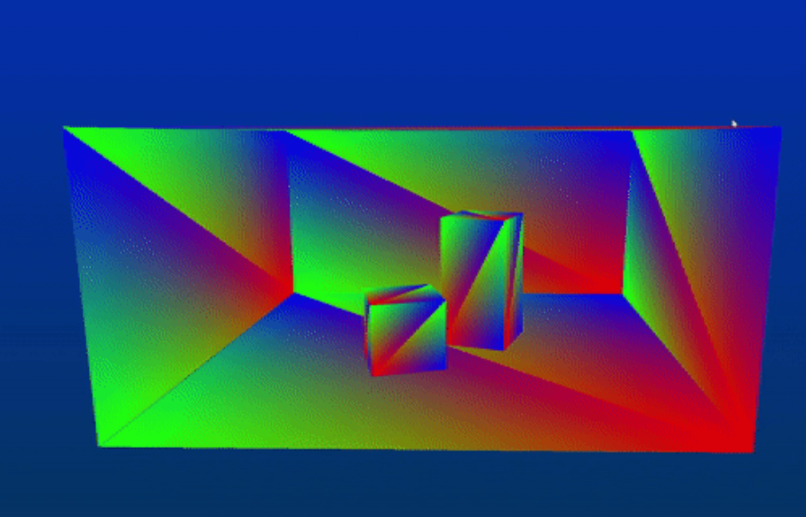

<b>Second step - getting per-instance data. Here I am rendering the normals.</b><br>

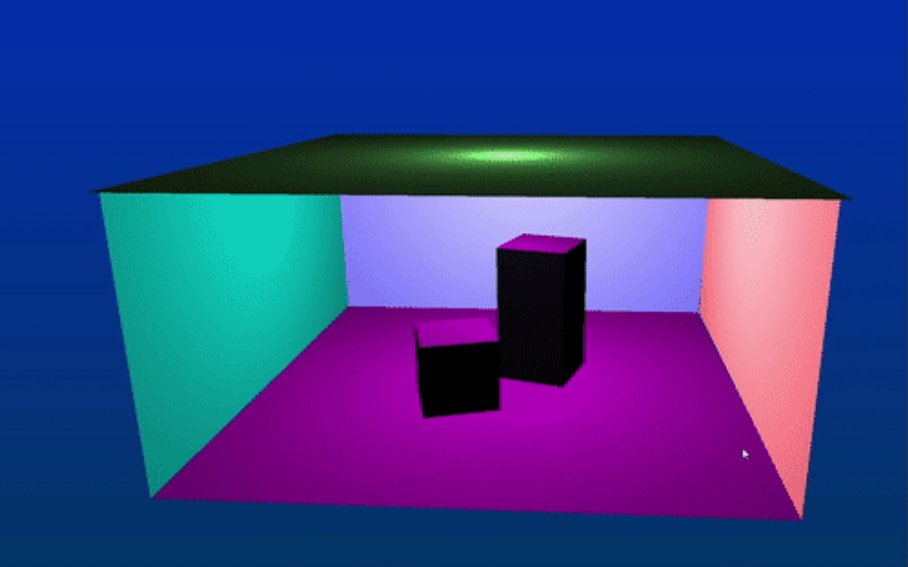

<b>Final step - rendering textures.</b><br>

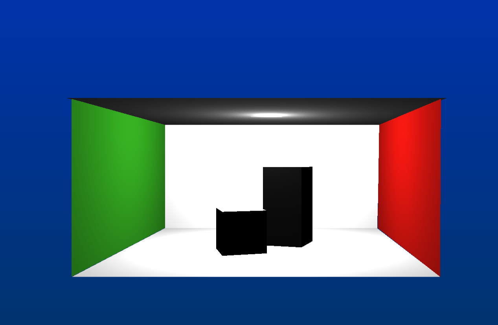


<h2>Integrating RTXGI</h2>
RTXGI integration, as per the SDK documentation, can be categorized into two phases: load-time and run-time. While I was able to implement both, I encountered challenges in regards to the run-time steps, which have yet to be resolved.

<h3>Load-time integration</h3>
Here’s a step-by-step breakdown of initializing the RTXGI algorithm based on the <a href="https://github.com/NVIDIAGameWorks/RTXGI/blob/main/docs/Integration.md">documentation</a>:

1. Compile the SDK's DDGI shaders with the DirectX Shader Compiler (DXC)
2. Describe the properties of one or more DDGIVolume
3. Describe the resources of one or more DDGIVolume
4. Create the DDGIVolume(s)

Before diving into the volume initialization process, it's crucial to understand what DDGIVolumes are. According to the documentation, a DDGIVolume is a “defined volume of space that supports irradiance queries at arbitrary world-space locations”. In simpler terms, these volumes define spaces within which the algorithm can query for irradiance. They contain probes, needed to calculate indirect lighting. For this calculation, the SDK requires these resources:

- Probe data texture array - used to save the world offset and classifications of each probe.
- Ray data texture array- used to save the raytraced calculated radiance int the first 3 channels, and the hitT value in the 4th channel.
- Irradiance data texture array - used to store the blended irradiance from the probes.
- Distance data  texture array- used to store the distance data 

In terms of resource creation, RTXGI provides two modes: managed and unmanaged. Managed mode, which is what I went with, streamlines the process, as it handles texture creation and management, requiring me only to provide resources and heap slots. This will be important later.

The initial step involved compiling the SDK shaders, guided by the GitHub documentation, as some defines needed to be added before compilation.
Next, I defined the properties for a    `DDGIVolume::origin`, probe spacing, probe count and texture formats. Something I only learned at the end of this project is that it's important to keep the probe density optimal to avoid visible patterns in the final output. Moreover, adjusting the probeViewBias based on scene scaling is critical to prevent light leaking.

<b>Probe grid visualization</b>

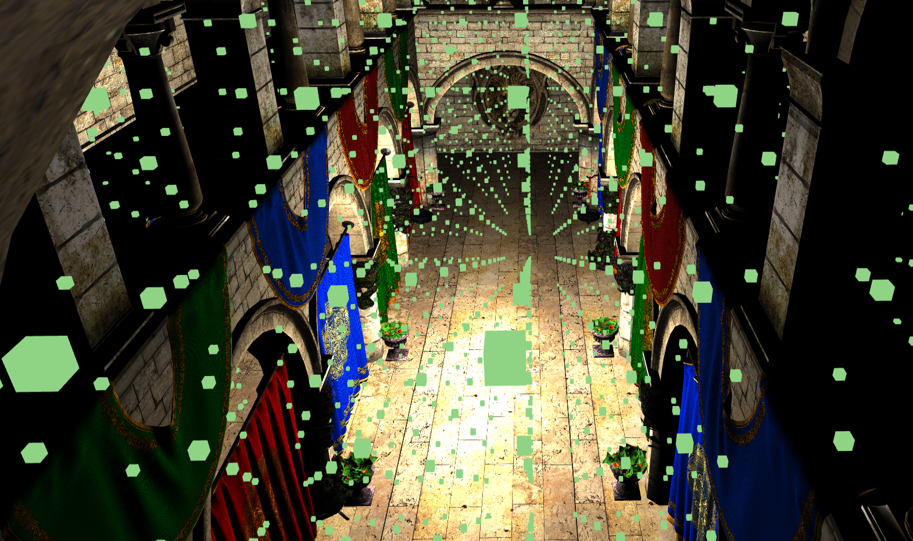


<h4>Volume description example</h4>

```c++ 
std::string name = "volume";
rtxgi::DDGIVolumeDesc volumeDesc{};
volumeDesc.name = name.data();
volumeDesc.rngSeed = 0;
volumeDesc.showProbes = true;
volumeDesc.eulerAngles = rtxgi::float3(0.f, 0.f, 0.f);
volumeDesc.origin = rtxgi::float3(-0.4f, 5.4f, -0.25f);
volumeDesc.probeSpacing = rtxgi::float3(5.1f, 2.5f,2.25f);
volumeDesc.probeCounts = rtxgi::int3(22, 22, 22);


volumeDesc.probeNumRays = 256;
volumeDesc.probeNumIrradianceTexels = 8;
volumeDesc.probeNumIrradianceInteriorTexels = 6;
volumeDesc.probeNumDistanceTexels = 16;
volumeDesc.probeNumDistanceInteriorTexels = 14;
volumeDesc.probeHysteresis = 0.97f;
volumeDesc.probeNormalBias = 0.1f;
volumeDesc.probeViewBias = 0.3f *8;
volumeDesc.probeMaxRayDistance = 10000;
volumeDesc.probeIrradianceThreshold = 0.2f;
volumeDesc.probeBrightnessThreshold = 1.f;
volumeDesc.probeRayDataFormat = rtxgi::EDDGIVolumeTextureFormat::F32x4;
volumeDesc.probeIrradianceFormat = rtxgi::EDDGIVolumeTextureFormat::F32x4;
volumeDesc.probeDistanceFormat = rtxgi::EDDGIVolumeTextureFormat::F16x2;
volumeDesc.probeDataFormat = rtxgi::EDDGIVolumeTextureFormat::F16x4;
volumeDesc.probeVariabilityFormat = rtxgi::EDDGIVolumeTextureFormat::F16;

volumeDesc.probeRelocationEnabled = false;
volumeDesc.probeMinFrontfaceDistance = false;
volumeDesc.probeClassificationEnabled = false;
volumeDesc.probeVariabilityEnabled = false;

volumeDesc.movementType = rtxgi::EDDGIVolumeMovementType::Default;
```

Describing the `rtxgi::d3d12::DDGIVolumeResources` structure was the next challenge, especially since managed mode is less documented. First of all, I had to fill the `rtxgi::d3d12::DDGIVolumeResources::managed` values. Here I provided the previously compiled shader buffers as well as a device and finally enabled managed mode. After this I needed to provide a few more things:
1. A sampler heap
2. A resource heap
3. A resource for the volume constants
4. An upload resource for the volume constants

Since the SDK relies on the heaps provided by the application, it's crucial for the application to accurately pass the index slots of each managed resource along with the resources created in the heap. This ensures the SDK allocates them correctly. To handle this, I track the last used slot in a heap with and int and then add to it whenever I need to allocate a new resource. To help with this, the SDK provides a helper function that specifies the required number of textures for each texture array `rtxgi::GetDDGIVolumeNumTex2DArrayDescriptors()`.

<h4>Usage example</h4>

```c++
volume.resourceIndices.probeDataSRVIndex = heapResourceIDCount;
raytracing::resourceIndices.probeDataUAVIndex = raytracing::resourceIndices.probeDataSRVIndex + rtxgi::GetDDGIVolumeNumTex2DArrayDescriptors();
raytracing::resourceIndices.probeDistanceSRVIndex = raytracing::resourceIndices.probeDataUAVIndex + rtxgi::GetDDGIVolumeNumTex2DArrayDescriptors();
<...>
heapResourceIDCount+=rtxgi::GetDDGIVolumeNumTex2DArrayDescriptors() *12; 
```
Finally, I created the volume using `rtxgi::d3d12::DDGIVolume::Create()`, which returns whether the volume has been initialised properly.

<h3>Run-time integration</h3>
Run-time integration proved more complex. The steps include:

1. Updating and uploading constants for each volume
2. Tracing probe rays
3. Updating probes with raytraced data
4. Querying irradiance.

First step is just calling DDGIVolume::Update() and UploadDDGIVolumeConstants(). The latter again returns an enum stating whether the update was successful.

The SDK does not provide a ray generation shader, thus I wrote one myself. Thankfully, the documentation gives a guideline of what this shader should do, and the sample project also has a ray generation shader which I heavily referenced while writing mine. 

<b>Results from raytracing probe rays</b>

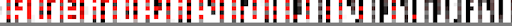


The third step is managed by the SDK and it is called by rtxgi::d3d12::UpdateDDGIVolumeProbes(). This function dispatches two compute shaders - the irradiance blending shader, and the distance blending shader. These two shaders will update and record data into the irradiance and distance textures respectively.

<b>Blended distance results</b>

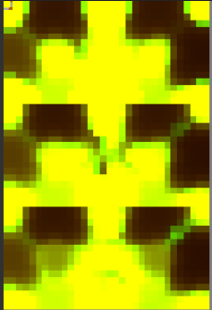

<b>Blended irradiance results</b>

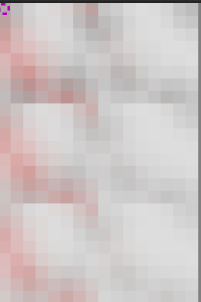


The final step is querying the irradiance. Again, the sdk does not provide a shader, but the sample project does have a compute shader for this, so I heavily based mine off of it. It is important to note that one does not need to complete this step with a compute shader, as this can be done with a pixel shader. That said, I was on a time crunch, therefore I decided that referencing an already made shader would be easier than researching how could I use a pixel shader for this. Unfortunately, something I only realised later into the project, is that a GBuffer is needed when performing this step with a compute shader, which I did not have until this point. Nevertheless, I quickly created 3 more textures, into which I rasterized the normals, vertex positions and albedo - the only data that the shader needs. Once I had all the “ingredients”, writing the shader was not difficult.

After debugging on Pix and making sure all the resources were being bound correctly, and carefully adjusting the probes, I finally got the irradiance data saved in the appropriate texture. Once this was done, all I had left to do was sum it with the direct lighting. These are the results:

<b>Cornell box with GI</b>
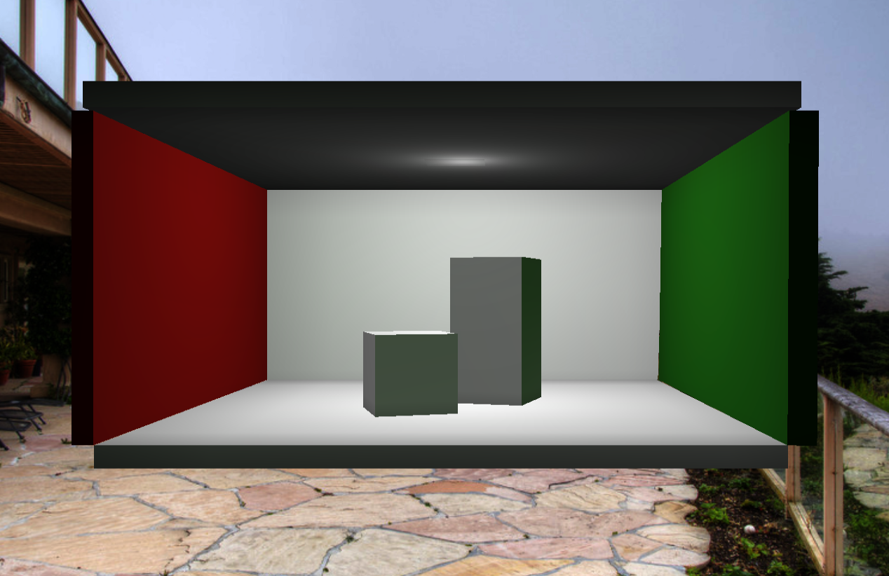


<b>Irradiance result for cornel box</b>

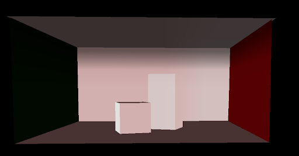

<b>Cornell box with direct lighting only </b>

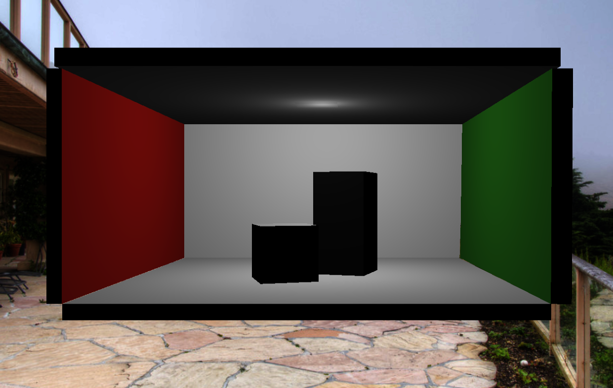


<h2>Summary</h2>

In this blog post I have gone through all the steps I have taken to intergrate RTXGI. While I managed to get global illumination, I was not able to do the optional steps that the documentation suggested. This means that I cannot use GI on more complicated scenes, as without relocation and classification probes will end up inside meshes. This causes very dark results.

<b>Sponza's irradiance calculations are dark, as a lot of probes are inside walls and columns.</b>
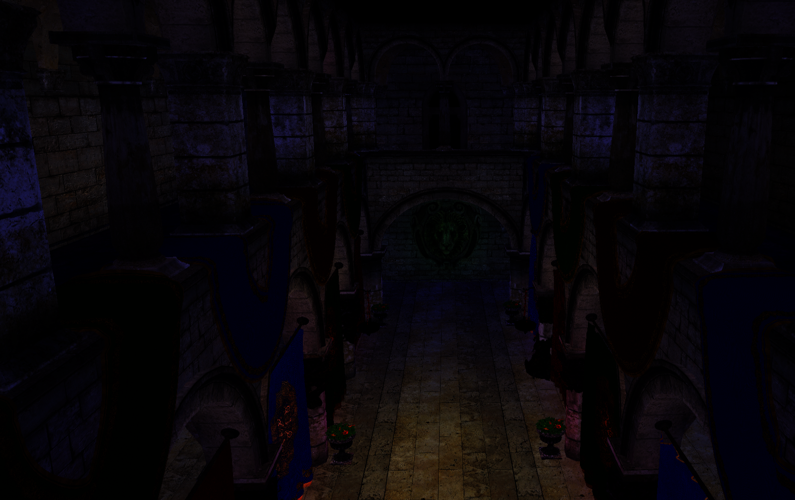


<h2>Future plans </h2>
Going forward, I will want to finish this project by adding the optional steps of probe relocation and classification. While I tried to do that at the end of the block, I couldn't manage to get the appropriate shaders working, therefore the ProbeData texture was always black.
Another thing I would like to implement is the ability to modify the probe grid and volume thresholds through a GUI window. One of the most anoying things about working with the SDK was making sure the probes were positioned correctly, especially when I had relocation and classification disabled. For this reason, I believe it will be a very useful addition to my project. 


